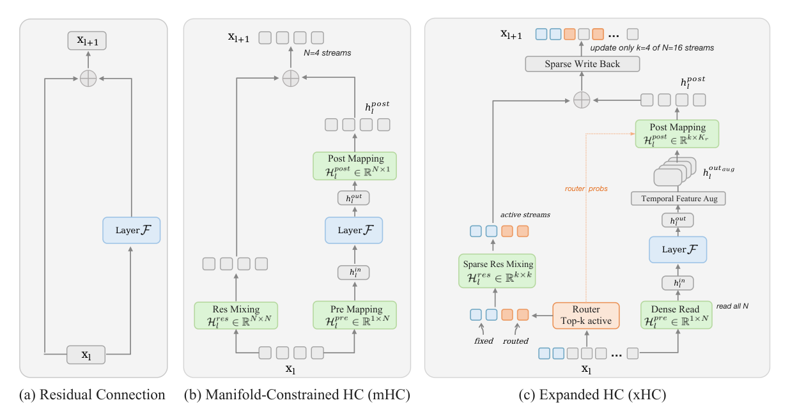
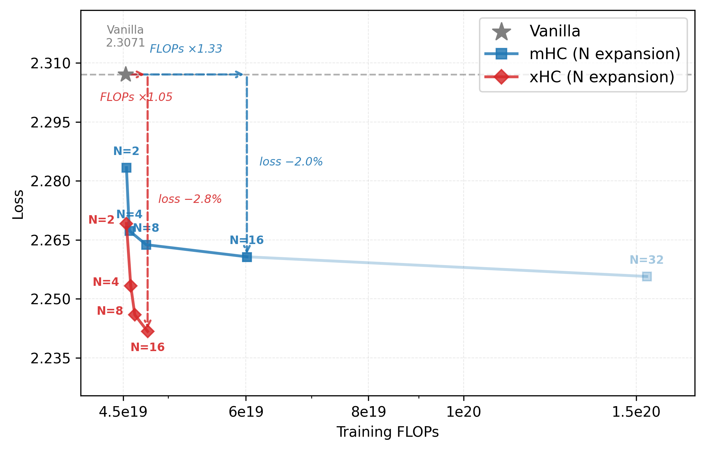
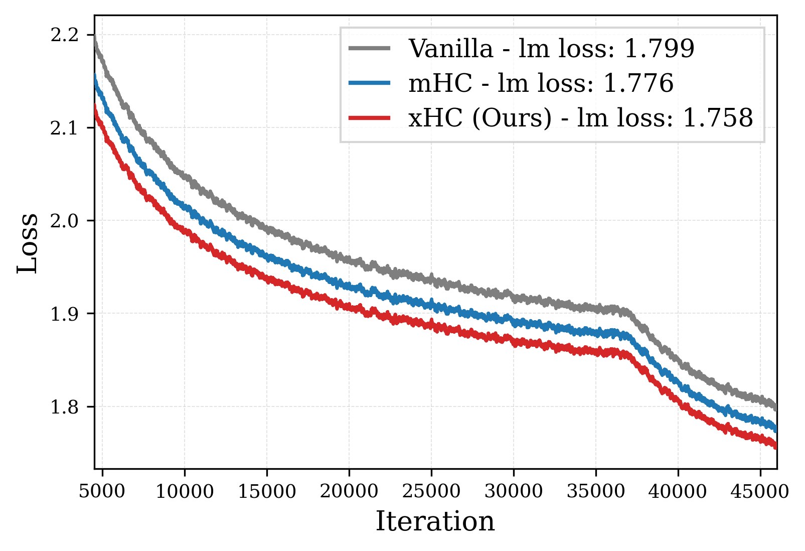
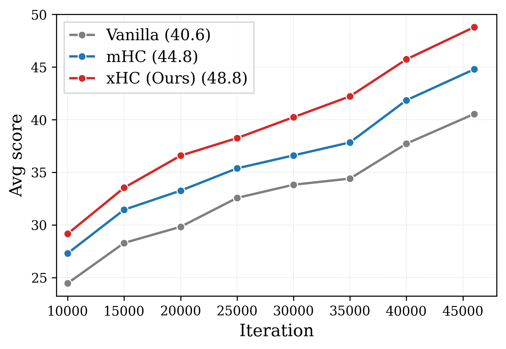
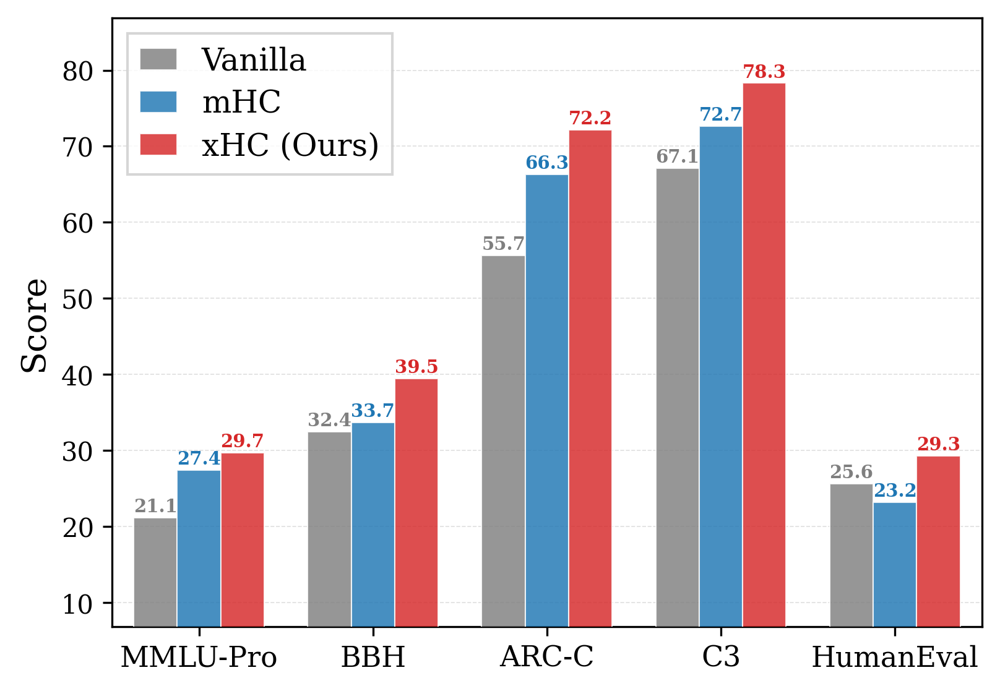
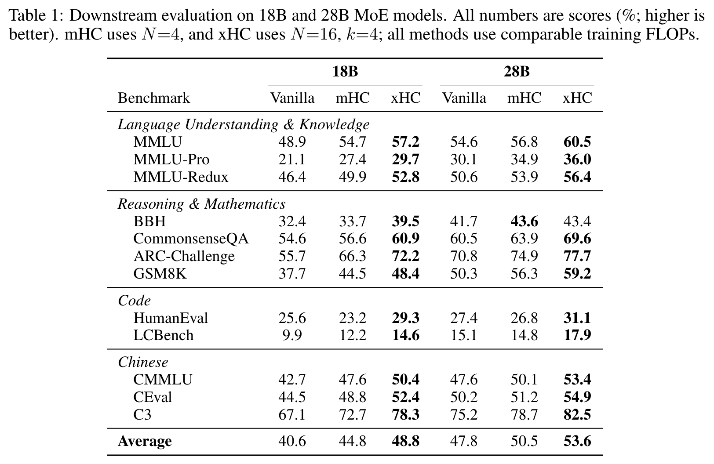
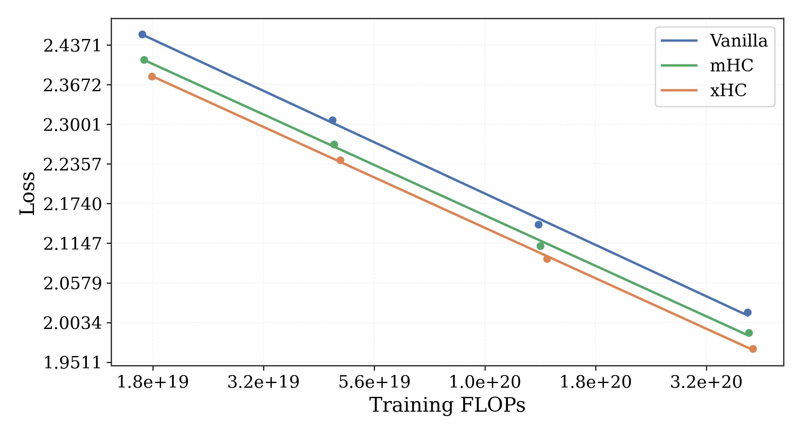

<div align="center">

<h1>xHC: Expanded Hyper-Connections</h1>

<p><strong>Scale Residual Streams Wider · Push Model Intelligence Further</strong></p>

<p>
  <a href="https://arxiv.org/abs/2607.14530"><strong>arXiv</strong></a>
  &nbsp;|&nbsp;
  <a href="paper/xHC_technical_report.pdf"><strong>Technical Report</strong></a>
  &nbsp;|&nbsp;  
  <a href="#citation"><strong>Citation</strong></a>
</p>

</div>

<p align="center">
  
</p>

<p align="center"><em>
xHC expands the residual state to N=16 streams, reads all streams, and sparsely updates only k=4 active streams.
</em></p>

## News

- **2026.09** 🎉 xHC has been accepted to **NeurIPS 2026**!
- **2026.07** We released the [xHC technical report](https://arxiv.org/abs/2607.14530) on arXiv.

## Overview

Hyper-Connections (HC) expand the Transformer residual stream into $N$ parallel streams, introducing a memory-scaling axis complementary to model width and depth. Manifold-Constrained Hyper-Connections (mHC) stabilize this formulation at scale, but existing HC-family methods typically stop at $N=4$.

We show that directly scaling mHC beyond $N=4$ runs into two bottlenecks:

- **Information supply:** one write-back vector must provide new information to an increasing number of streams, making additional streams progressively redundant.
- **Residual-mapping cost:** generating a dense $N\times N$ mapping from an $NC$-dimensional state scales as $O(N^3C)$.

<p align="center">
  
</p>

<p align="center"><em>
Scaling mHC from N=4 to N=16 brings diminishing gains at rapidly increasing cost; xHC changes this trade-off.
</em></p>

**xHC (Expanded Hyper-Connections)** is the first HC-family method to achieve meaningful expansion beyond $N=4$. Its main configuration uses $N=16$ residual streams and updates only $k=4$ streams at each sublayer.

## Method

xHC combines two complementary designs:

1. **Temporal feature augmentation** enriches MLP write-back with multi-scale local features produced by causal depthwise convolutions over neighboring tokens. This supplies a more diverse information basis as the number of residual streams grows.
2. **Sparse residual-stream updates** preserve dense read access to all $N$ streams while routing residual mixing and write-back through only $k$ active streams. The dominant residual-mapping generation cost is reduced from $O(N^3C)$ to $O(k^3C)$.

For practical deployment, **xHC-Flash** shares full-state operations across consecutive sublayers and reconstructs later sublayer inputs with lightweight corrections. It substantially reduces memory traffic while preserving nearly all of the performance gains of full xHC.

<a id="results"></a>
## Results

### Broad Gains at 18B Scale

<table>
  <tr>
    <td width="33%"></td>
    <td width="33%"></td>
    <td width="33%"></td>
  </tr>
  <tr>
    <td align="center"><strong>Training loss</strong></td>
    <td align="center"><strong>Average downstream score</strong></td>
    <td align="center"><strong>Benchmark-level gains</strong></td>
  </tr>
</table>

<p align="center">
  
</p>

Across 12 language understanding, reasoning, code, and Chinese benchmarks, xHC improves the average score over mHC by **4.0 points at 18B** and **3.1 points at 28B**. At 28B, xHC outperforms mHC on 11 of the 12 evaluated benchmarks.

### Compute Efficiency

<p align="center">
  
</p>

<p align="center"><em>
xHC traces a consistently lower loss curve than mHC and the vanilla residual baseline across training compute.
</em></p>

- On the 18B MoE model, xHC reaches a final training loss of **1.758**, compared with **1.776** for mHC and **1.799** for the vanilla baseline.
- To reach the same loss as xHC, the vanilla and mHC baselines require **$1.50\times$** and **$1.19\times$** as much training compute, respectively.
- Increasing $N$ from 4 to 16 improves loss by **0.012** in xHC with only **4%** additional training FLOPs. The same expansion in mHC improves loss by only **0.006** while increasing training FLOPs by **32%**.
- xHC remains effective under Muon, indicating that its gains are not specific to AdamW.

### Memory Efficiency

Estimated per-token memory traffic, amortized per Transformer sublayer. Here, $C$ is the hidden dimension, and validation loss is measured in the 10B ablation setting.

| Method | I/O per sublayer | Validation loss |
|:--|--:|--:|
| mHC ($N=4$) | $34C$ | 2.004 |
| xHC | $73.5C$ | **1.983** |
| xHC-Flash | $51C$ | **1.983** |
| xHC-Flash-4sub | $40C$ | 1.984 |

**xHC-Flash-4sub approaches the memory traffic of mHC at $N=4$ while retaining a clear performance advantage.**

### Practical Runtime

Our implementation uses fused forward and backward kernels to reduce intermediate tensor materialization and kernel-launch overhead.

- On the 18B MoE model, our fused mHC implementation adds approximately **15%** training overhead over the vanilla baseline, while xHC-Flash-4sub adds approximately **11%** on top of mHC. Pipeline-communication overlap is disabled in these measurements to isolate the computational overhead of residual-stream operations.
- For inference prefill at 2K tokens, mHC and xHC-Flash-4sub add **11.4%** and **12.9%** overhead over the vanilla baseline, respectively. The total prefill latency of xHC-Flash-4sub is only **1.3%** higher than that of mHC.

<details>
<summary><strong>Default xHC configuration</strong></summary>

| Setting | Value |
|:--|:--|
| Expansion streams | $N=16$ |
| Active streams | $k=4$ |
| Fixed / routed active streams | 2 / 2 |
| Temporal augmentation | MLP side only |
| Causal convolution kernels | $\{4,8,12\}$ |
| Residual mixing | Sinkhorn-normalized over active streams |

</details>

## Citation

```bibtex
@misc{zhang2026xhcexpandedhyperconnections,
  title         = {xHC: Expanded Hyper-Connections},
  author        = {Xiangdong Zhang and Xiaohan Qin and Sunan Zou and Tuo Dai and
                   Xiaoming Shi and Huaijin Wu and Yebin Yang and Zhuo Xia and
                   Shaofeng Zhang and Lin Yao and Yuliang Liu and Yu Cheng and
                   Junchi Yan},
  year          = {2026},
  eprint        = {2607.14530},
  archivePrefix = {arXiv},
  primaryClass  = {cs.LG},
  url           = {https://arxiv.org/abs/2607.14530}
}
```

## Contact

For questions about the paper, please contact `zhangxiangdong@sjtu.edu.cn`.
